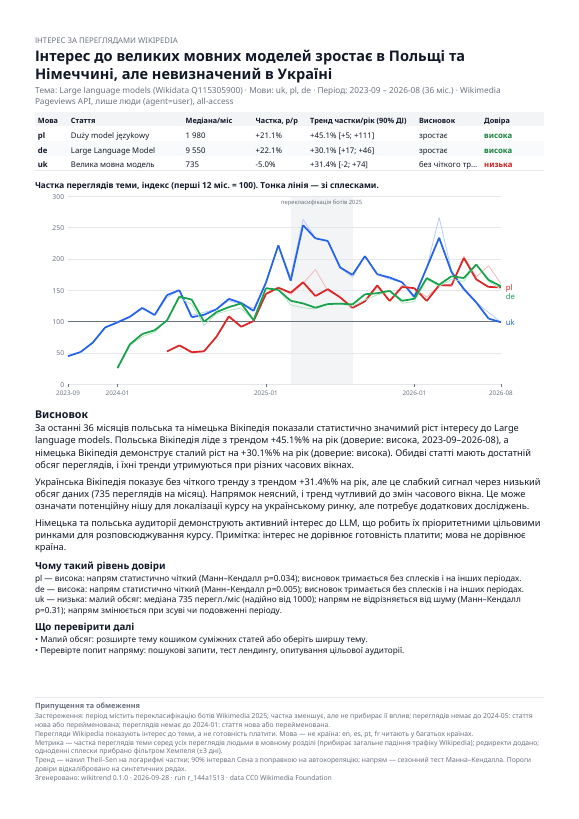
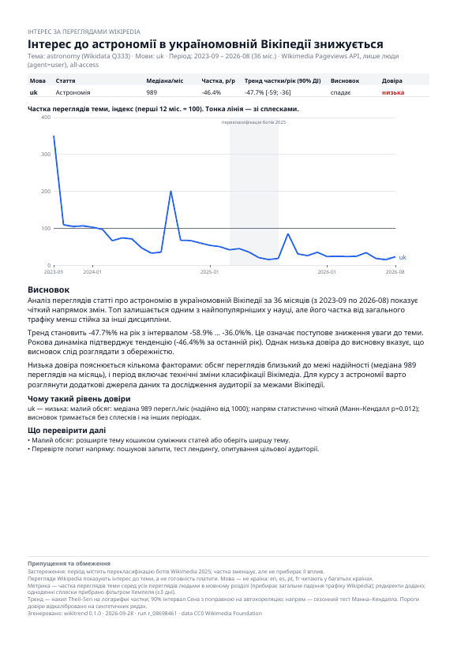
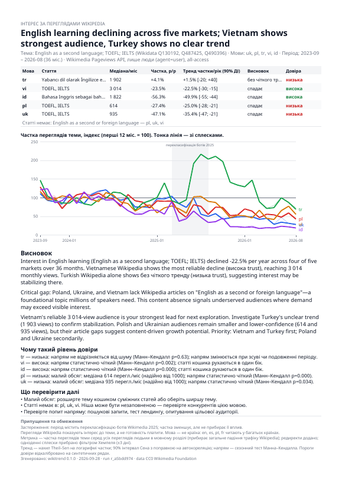
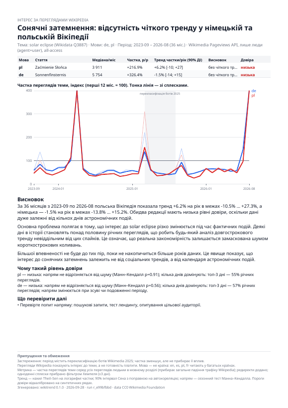

# Examples: real answers from a cheap model

**EN** · [UA](#ua)

Ten real sessions. Every question was asked to **Claude Haiku 4.5** in Claude Code, exactly as a user would ask it, in a clean directory with only this skill installed. Nothing was edited by hand. The data is live Wikipedia pageviews, September 2023 – August 2026.

Every folder contains:

| File | What |
|---|---|
| `answer.md` | the user's question and the agent's full chat answer |
| `report.pdf` | the one-page report the agent produced |
| `report.png` | a preview of that page |
| `chart.svg` | the chart on its own (opens in a browser) |

All percentages in all answers were checked automatically against the CLI output (`evals/check.py`): none of them is invented.

| # | Case | What it shows | Result |
|---|---|---|---|
| 01 | [Astronomy, Ukrainian](01-astronomy-ukrainian-declining-low-trust/) | task example 2 | uk −47.7%/yr, declining, **low** trust: only 989 views/month |
| 02 | [Intermittent fasting, Polish vs Czech, 2 years](02-intermittent-fasting-polish-czech-missing-article/) | task example 1; missing article; short window | **no Polish article at all**; cs no clear trend, low trust |
| 03 | [Learning English, 5 languages](03-learning-english-5-languages-basket/) | task example 3; topic basket; ranking | declining everywhere; vi and id high trust; tr stable |
| 04 | [Large language models, uk/pl/de](04-large-language-models-growing-high-trust/) | **real growth with high trust** | pl +45.1%/yr, de +30.1%/yr (high); uk +31.4% but low trust |
| 05 | [Pickleball, uk/de](05-pickleball-growing-but-low-trust/) | growth you should not trust yet | uk +45.9%/yr but only 478 views/month → low trust |
| 06 | [Cybersecurity, es/pt/it, custom criteria](06-cybersecurity-custom-criteria/) | the user's own thresholds (≥20%/yr, ≥3000 views) | no language qualifies; es and it declining with high trust |
| 07 | [“Mercury”](07-ambiguous-topic-mercury-asks-user/) | ambiguous topic | the agent **asks**: planet, chemical element, god…? |
| 08 | [LLM → “desktop only, last 2 years?”](08-follow-up-desktop-2-years-from-cache/) | follow-up question | de desktop +18.7%/yr, high trust; short-window caveat |
| 09 | [Rust, de/fr, in English](09-rust-report-in-english/) | report in English | no clear trend in either language |
| 10 | [Solar eclipses, de/pl](10-solar-eclipse-spikes-are-not-growth/) | spikes are not growth | top-3 days = 55–57% of the yearly views → no trend, low trust |

## Previews

| Growth with high trust (04) | Declining, low trust (01) |
|---|---|
|  |  |

| Five languages, topic basket (03) | Spikes are not growth (10) |
|---|---|
|  |  |

## Honest notes

- The **numbers** come from code and were verified. The **interpretation** is the model's.
  - In 03, the model calls missing articles "hidden demand". The data only says the article is missing.
- Some languages are marked "declining" even for popular topics. The metric is the topic's **share** of all views of the edition, and Wikipedia traffic is shifting between topics as AI answers replace some reading.
- While building this gallery, reviewing the answers exposed bugs, which were then fixed:
  - raw `{{placeholders}}` appeared in a chat answer;
  - one answer came in German to a Ukrainian question;
  - a new article's line on the chart went off the scale;
  - the "≠" sign vanished from the PDF;
  - a "%%" typo appeared;
  - a report in English got Ukrainian labels.
- Regenerate everything with `examples/generate.sh`. It needs the `claude` CLI and costs about $0.5 on Haiku.

---

## UA

Десять реальних сесій. Кожне питання поставлено **Claude Haiku 4.5** у Claude Code так, як його поставив би користувач, у чистій папці лише з цією навичкою. Нічого не редаговано вручну. Дані — живі перегляди Вікіпедії, вересень 2023 – серпень 2026.

У кожній папці:
- `answer.md` — питання й повна відповідь агента в чаті;
- `report.pdf` — звіт на одну сторінку;
- `report.png` — його превью;
- `chart.svg` — окремо графік.

Усі відсотки в усіх відповідях автоматично звірено з виводом CLI: вигаданих немає.

**Що показує кожен кейс:**

| # | Кейс | Що видно |
|---|---|---|
| 01 | Астрономія | приклад із завдання: падіння, довіра низька через малий обсяг |
| 02 | Інтервальне голодування | приклад із завдання: **польської статті немає взагалі**, попередження про коротке вікно |
| 03 | Вивчення англійської | приклад із завдання: кошик тем і 5 мов, рейтинг аудиторій |
| 04 | Великі мовні моделі | **реальне зростання з високою довірою**: pl +45%, de +30% на рік |
| 05 | Піклбол | росте, але довіряти ще не можна: замало переглядів |
| 06 | Кібербезпека | власні критерії користувача (≥20%/рік, ≥3000 переглядів) |
| 07 | «Меркурій» | неоднозначна тема: агент **перепитує**, а не вгадує |
| 08 | LLM, уточнення «лише десктоп за 2 роки» | уточнення з кешу, попередження про коротке вікно |
| 09 | Rust | звіт англійською |
| 10 | Сонячні затемнення | сплески — не зростання: навичка на них не ведеться |

**Чесні примітки:**
- Числа рахує код, і їх перевірено. Інтерпретація — модельна: у 03 модель називає відсутні статті «прихованим попитом», хоча дані кажуть лише, що статті немає.
- Під час збирання цієї галереї перегляд відповідей виявив 6 вад, і всі вони виправлені:
  - сирі плейсхолдери в чаті;
  - відповідь німецькою на українське питання;
  - лінія нової статті, що виходила за межі графіка;
  - зникнення символу «≠» у PDF;
  - подвійне «%%»;
  - українські підписи в англійському звіті.
